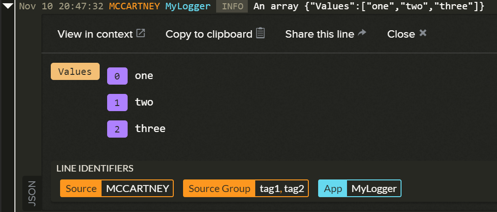

# RedBear.LogDNA.Extensions.Logging.Web
[LogDNA](https://logdna.com) provider for [Microsoft.Extensions.Logging](https://www.nuget.org/packages/Microsoft.Extensions.Logging) in ASP.NET Core 2.0.

## Installation

```
Install-Package RedBear.LogDNA.Extensions.Logging.Web
```

## Configuring the provider

To add the LogDNA provider in **ASP.NET Core 2.0+**:

```csharp
public void ConfigureServices(IServiceCollection services)
{
  services.AddMvc();

  var options = new LogDNAOptions(Configuration["IngestionKey"], LogLevel.Debug)
  					.AddWebItems();

  services.AddLogging(loggingBuilder => loggingBuilder.AddLogDNA(options));
}
```

## LogDNAOptions Class

The `AddLogDNA()` method has an override that takes an instance of a `LogDNAOptions` class:

```csharp
var options = new LogDNAOptions("ingestion_key");
options.LogLevel = LogLevel.Warning;
options.HostName = "MyHost";
options.Tags = new [] { "one", "two" };
options.MessageDetailFactory.RegisterHandler((detail) => 
  {
  	detail.AddOrUpdateProperty("Foo", "Bar");
  });

loggerFactory.AddLogDNA(options);
```

The `LogDNAOptions` class has the following properties:

* `LogLevel` - to set the default log level (default is `Warning`);
* `HostName` - used to override the machine's hostname. Defaults to `Environment.MachineName`;
* `Tags` - to be associated with the host. Defaults to `null`;
* `MessageDetailFactory` - see next section. 

Additionally, different log levels can be set for different namespaces using the `.AddNamespace(namespace, level)` method:

```csharp
// Would apply to all log names starting with "MyApp." - e.g. MyApp.Services, MyApp.Models, etc
options.AddNamespace("MyApp.", LogLevel.Debug);
```

It is recommended to set the default log level (`options.LogLevel`) to `Warning` and then set a lower log level for your own code using `AddNamespace()`.

## MessageDetail class and IMessageDetailFactory

The `MessageDetail` class is serialised to create a JSON message for LogDNA to ingest:

```json
{
  message : "This is my messsage",
  level : "WARN",
  IpAddress : "127.0.0.1",
  Language : "en-GB",
  TraceId : "0HL99A22ATG42:00000001",
  Url : "http://localhost:62014/",
  UserAgent : "Mozilla/5.0 (Windows NT 10.0; Win64; x64) AppleWebKit/537.36 (KHTML, like Gecko) Chrome/62.0.3202.89 Safari/537.36"
  Value : {
    Foo : "foo",
    Bar : "bar"
  }
}
```

Each new instance of a `MessageDetail` class is produced by an implementation of `IMessageDetailFactory`. 

The properties of the `MessageDetail` JSON can be further customised by registering an `Action<MessageDetail>` event handler that will fire whenever a new `MessageDetail` class is created:

```csharp
var options = new LogDNAOptions("ingestion_key");

options.MessageDetailFactory.RegisterHandler((detail) => 
  {
  	detail.AddOrUpdateProperty("Foo", "Bar");
  });

loggerFactory.AddLogDNA(options);
```

## Enforcing JSON serialisation of objects

The Microsoft logging framework will occasionally try and use its own form of serialisation, typically when dealing with `IEnumerable<>` objects.

To ensure that the original object is serialised into JSON and that a value appears as follows in LogDNA, use the `Wrapper` class.



```csharp
var array = new string[] { "one", "two", "three" };
logger.LogInformation("An array", new Wrapper(array));
```

The logger will *unwrap* the object prior to serialisation.

## Notes

Please remember that indexing of log entries only happens on paid accounts. This means you **won't** see JSON representations of objects or coloured highlighting of `INFO`, `WARN`, etc, if you are using a free account.

Also, please remember LogDNA's [standard service limits for ingestion](https://docs.logdna.com/docs/ingestion#section-service-limits).

